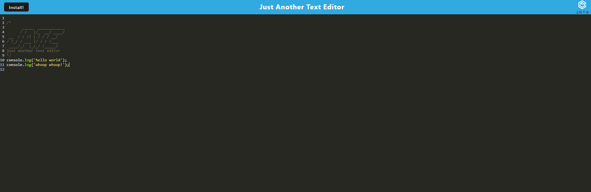
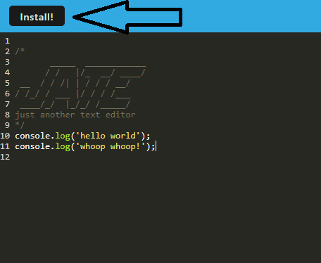
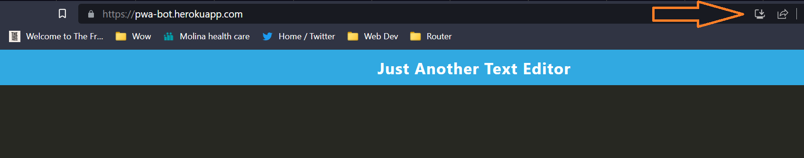
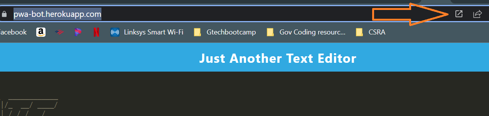
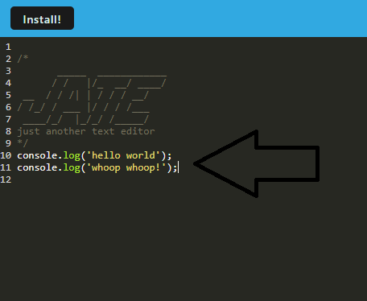
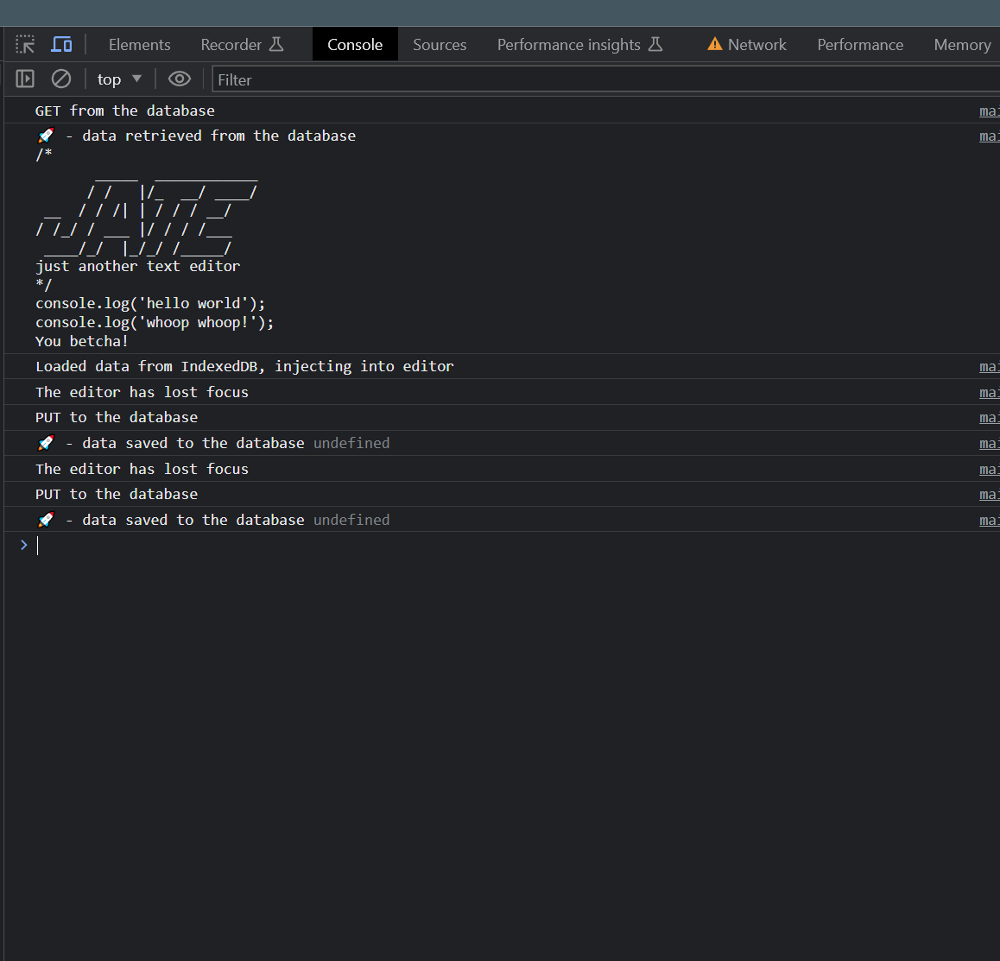
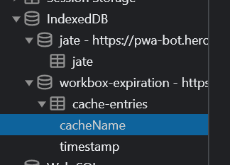
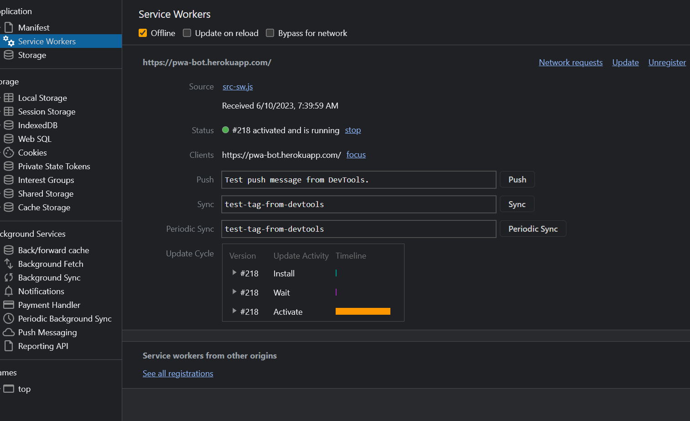

# PWABOT2 

## Text editor app with complete service worker functionality, caching, and offline capabilities.

The purpose of this app is to provide a functional browser-based text editor application with full downloadable capabilities and offline support. This application allows a user to write and edit code and save the content for later use, both online, and offline via service worker support and client-side databasing with indexedDB API. In addition, if the user so wished, the browser-based app can be downloaded to the user's workspace to be used outside the browser environment.

## Table of Contents (Optional)

If your README is long, add a table of contents to make it easy for users to find what they need.

- [Installation](#installation)
- [Usage](#usage)
- [Credits](#credits)
- [License](#license)

## Installation

In order to use the application, a user can navigate to https://pwa-bot.herokuapp.com/ 

and start working. Additionally, there are two ways in which the app can be downloaded and used in a local app. The first is to use the install button:

Upon pressing the button, the app will download and be useable in the local environment.

Additionally, the user can use the install icon used in the browser URL line:

The app can be opened on into the local environment by clicking on the open app button in the browser URL once the app has been installed:

## Usage

In order to use the site, just write text in the editor.

If you wish to see more information about what's going on inside the editor. Press f12 or right click and select 'inspect'. Navigate to the console tab and information will be displayed as work is done in the editor.

Whenever you click off the browser or the app, information is saved to the indexedDB client-side DB api:

Service workers cache pages to be saved for use offline:

## Credits

Xandromus - Xander Rapstine provided the starter code for the application.

## License

This project uses a MIT License 
https://opensource.org/licenses/MIT

## How to Contribute

Direct questions to the following:

Github: https://github.com/DustinSwecker

Email: dustin.swecker@gmail.com
